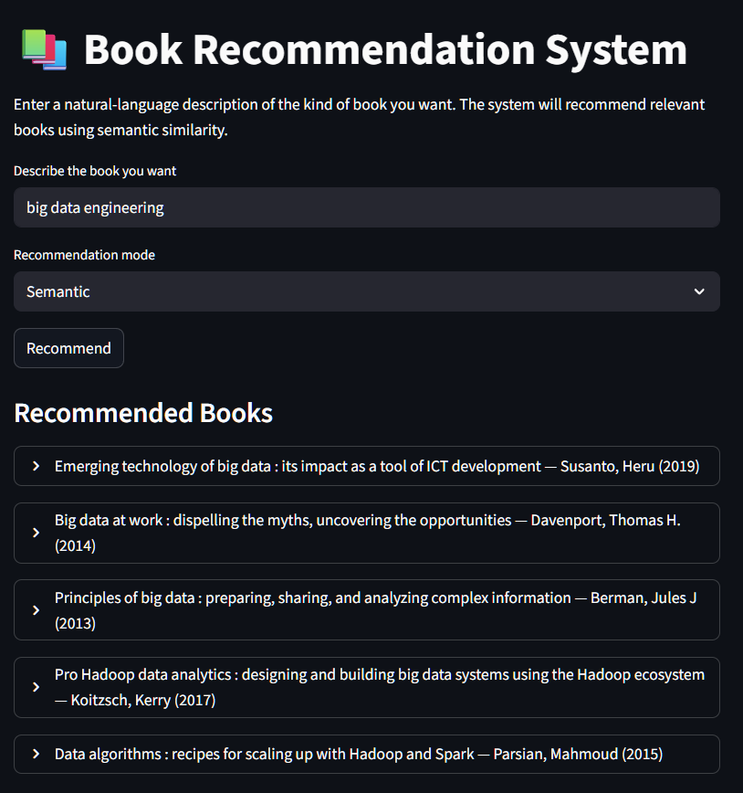

BOOK FINDER – DATA ENGINEERING PIPELINE
======================================

- Name: Megh Nanavati
- Roll No: 202518018
- Live Site Link: https://book-finder-dau.streamlit.app/



Figure: Streamlit-based interface for semantic and hybrid book search.

PROJECT OVERVIEW
----------------
This project implements an end-to-end data engineering and retrieval system
to collect, enrich, clean, store, and semantically search book metadata from
multiple heterogeneous sources.

The system integrates:
- Web scraping (Koha OPAC using Playwright)
- Public APIs (OpenLibrary, OpenAlex)
- Data cleaning and transformation pipelines
- Relational storage using SQLite
- Semantic and hybrid (BM25 + embedding) search
- Interactive serving via Streamlit

The pipeline is modular, reproducible, and runnable from the repository
root using scripted execution.

KEY FEATURES
------------
1. Multi-Source Data Enrichment
   - Koha OPAC (DAIICT) scraping using Playwright
   - OpenLibrary API enrichment using:
       ISBN → Edition → Work → Author hierarchy
   - OpenAlex API enrichment using:
       Title-based semantic matching

2. Robust Data Transformation
   - HTML and noise removal
   - Encoding artifact correction (’, â€, etc.)
   - Source-priority selection for descriptions and subjects
   - Normalized final text fields with provenance tracking

3. Persistent Local Storage
   - Cleaned dataset stored in SQLite (books.db)
   - Schema optimized for lookup and retrieval

4. Semantic & Hybrid Search
   - Sentence-transformer embeddings (MiniLM)
   - BM25 lexical retrieval
   - Hybrid candidate filtering + semantic reranking
   - Natural language queries supported

5. Interactive Web Interface
   - Streamlit-based UI
   - Hosted on Streamlit Community Cloud
   - Backend logic executed server-side within the app


PIPELINE EXECUTION FLOW
-----------------------
The pipeline is organized into four logical stages:

1. Ingestion
   - Load base dataset (CSV)
   - Enrich using Koha OPAC scraping
   - Enrich using OpenLibrary API
   - Enrich using OpenAlex API

2. Transformation
   - Merge all enriched datasets
   - Clean and normalize text fields
   - Construct final_description and final_subjects
     along with source metadata

3. Storage
   - Create SQLite database and schema
   - Load final dataset into database

4. Serving & Retrieval
   - Load SQLite database and precomputed embeddings
   - Execute semantic or hybrid search
   - Serve results via Streamlit web interface

PROJECT STRUCTURE
-----------------
```
book-finder/
│
├── src/
│   ├── __init__.py
│   ├── config.py                  # Centralized paths and constants
│   │
│   ├── ingestion/                 # Data collection from external sources
│   │   ├── __init__.py
│   │   ├── library_data_cleaner.py
│   │   ├── opac_data_scraper.py
│   │   ├── openlibrary_data_collector.py
│   │   └── openalex_data_collector.py
│   │
│   ├── transformation/            # Cleaning, merging, normalization
│   │   ├── __init__.py
│   │   ├── build_final_dataset.py
│   │   └── final_dataset_transformation.py
│   │
│   ├── analysis/                  # Dataset analysis and statistics scripts
│   │   ├── __init__.py
│   │   └── dataset_stats.py
│   │
│   ├── search/                    # Semantic + lexical search engine
│   │   ├── __init__.py
│   │   └── semantic_search.py
│   │
│   ├── api/                       # Backend logic (non-deployed, local)
│   │   ├── __init__.py
│   │   └── main.py
│   │
│   └── ui/                        # Streamlit UI
│       ├── __init__.py
│       ├── app.py
│       └── requirements.txt
│
├── data/
│   ├── raw/
│   │   └── books_data.csv
│   ├── interim/
│   │   ├── koha_enriched.csv
│   │   ├── openlibrary_enriched.csv
│   │   └── openalex_enriched.csv
│   └── processed/
│       ├── FINAL_MASTER_DATASET.csv
│       └── FINAL_MASTER_WITH_FINAL_TEXT.csv
│
├── storage/
│   ├── books.db                   # SQLite database
│   ├── db_books_load.py
│   └── db_create.py
│
├── logs/
│   └── llm_usage.md
│
├── book_embeddings.npy            # Precomputed sentence embeddings
├── book_row_ids.npy               # Embedding row-id alignment
├── matching.py                    # Search evaluation / experiments
│
├── run_all.ps1
├── run_all.sh
├── requirements.txt
└── README.md
```


INSTALLATION & SETUP
--------------------
Prerequisites:
- Python 3.10 or higher
- Internet access
- Chromium browser (installed by Playwright)

Virtual environment setup:

Windows:
python -m venv .venv
.\\.venv\\Scripts\\Activate.ps1

Linux/macOS:
python3 -m venv .venv
source .venv/bin/activate

Install dependencies:
pip install -r requirements.txt

Install Playwright browser:
playwright install chromium


RUNNING THE PIPELINE
-------------------
IMPORTANT:
All commands must be executed from the repository root.
Scripts are executed as Python modules, not as standalone files.

Automated execution:

Windows:
powershell -ExecutionPolicy Bypass -File .\\run_all.ps1

Linux/macOS:
chmod +x run_all.sh
./run_all.sh


MANUAL PIPELINE STEPS
--------------------

Base dataset cleaning:
python -m src.ingestion.library_data_cleaner

Koha OPAC enrichment:
python -m src.ingestion.opac_data_scraper

OpenLibrary enrichment:
python -m src.ingestion.openlibrary_data_collector

OpenAlex enrichment:
python -m src.ingestion.openalex_data_collector

Merge datasets:
python -m src.transformation.build_final_dataset

Final text construction:
python -m src.transformation.final_dataset_transformation

Create database:
python -m src.storage.db_create

Load database:
python -m src.storage.db_books_load

Dataset statistics:
python -m src.analysis.dataset_stats

RUNNING THE API
---------------
python -m uvicorn src.api.main:app --reload

Swagger UI:
http://127.0.0.1:8000/docs

EMBEDDING GENERATION & SEARCH INDEXING
------------------------------------

Embeddings are generated offline from the final cleaned dataset stored
in the SQLite database.

Process:
- Only rows with non-null descriptions are selected.
- For each book, a composite search text is constructed using:
  title + description + subjects + author.
- This text is encoded using a sentence-transformer model.

Technical details:
- Model used: all-MiniLM-L6-v2
- Embeddings are L2-normalized to enable cosine similarity via dot product.
- Embeddings are stored in NumPy format for fast loading.

Artifacts produced:
- book_embeddings.npy   : matrix of shape (N, 384)
- book_row_ids.npy      : row_id alignment for each embedding

These files are reused during application startup to avoid recomputation.


SEMANTIC AND HYBRID SEARCH LOGIC
-------------------------------

Two retrieval modes are supported:

1. Semantic Search
   - Query is encoded into an embedding.
   - Cosine similarity is computed against all stored embeddings.
   - Top-K most similar books are returned.

2. Hybrid Search (BM25 + Embeddings)
   - Query tokens are scored using BM25 over the text corpus.
   - Top-N lexical candidates are selected.
   - Semantic similarity is computed only for these candidates.
   - Final ranking is based on embedding similarity.

This hybrid approach improves keyword precision while preserving
semantic generalization for natural language queries.


STREAMLIT DEPLOYMENT
-------------------

The application is deployed using Streamlit Community Cloud.

Deployment model:
- GitHub repository is connected to Streamlit Cloud.
- Streamlit runs the app inside a managed container.
- All backend logic executes server-side within the Streamlit process.

At startup:
- SQLite database is loaded from the repository.
- Precomputed embeddings are loaded into memory.
- The search engine is cached to avoid repeated initialization.

User interaction:
- Browser acts only as a UI client.
- Search queries trigger backend execution on the server.
- No separate backend service is required in production.

Public access is provided via a Streamlit-hosted URL.


FASTAPI USAGE NOTE
-----------------

A FastAPI interface is implemented for local development and testing.

- Runs on localhost using Uvicorn.
- Exposes REST endpoints over the same database and search logic.
- Not used in the deployed Streamlit application.

In production, backend logic is executed directly inside the
Streamlit app instead of via HTTP calls.


PERFORMANCE CONSIDERATIONS
--------------------------

- Embeddings are precomputed to avoid runtime corpus encoding.
- NumPy-based similarity computation enables fast retrieval.
- Hybrid search limits expensive similarity calculations.
- In-memory caching reduces startup and query latency.


DEPLOYMENT LIMITATIONS
---------------------

- Backend was earlier deployed on Render, but due to RAM limitations on the free tier of Render, it was moved to
  Streamlit Cloud.
- CPU-only execution on Streamlit Cloud.
- Cold starts may occur after inactivity.
- SQLite is used for portability, not high concurrency.

These constraints are acceptable for academic and demonstration use.

DATABASE OVERVIEW SUMMARY
==========================

| Metric                        | Value              |
|-------------------------------|--------------------|
| Total rows                    | 32,255             |
| Distinct ISBNs                | 31,546             |
| Missing ISBNs                 | 409                |
| Missing descriptions          | 13,775             |
| Missing subjects              | 4,011              |
| Missing publication years     | 169                |
| Earliest publication year     | 1847               |
| Latest publication year       | 2026               |
| Average publication year      | 2004.50            |
| Average description length    | 975 characters     |
| Maximum description length    | 20,629 characters  |
| Top subject domain            | Computer Science   |
| Top subject count             | 4,465              |

DATABASE SCHEMA (books table)
----------------------------

| Column Name          | Type                    |
|----------------------|-------------------------|
| row_id               | INTEGER (Primary Key)   |
| isbn                 | TEXT                    |
| title                | TEXT                    |
| author               | TEXT                    |
| year                 | INTEGER                 |
| publisher            | TEXT                    |
| description          | TEXT                    |
| subjects             | TEXT                    |
| description_source   | TEXT                    |
| subjects_source      | TEXT                    |


DATA TRANSFORMATION LOGIC
------------------------
Description Cleaning:
- HTML tag removal
- Encoding artifact correction
- Removal of placeholder text
- Preference-based source selection

Subject Cleaning:
- Semicolon-separated normalization
- Best non-empty source selected

Year Cleaning:
- Valid years restricted to 1800–2026
- Invalid values set to NULL


WHY PLAYWRIGHT WAS USED
----------------------
Koha OPAC employs dynamic rendering and bot-detection mechanisms.
Traditional HTTP-based scrapers often fail or are blocked.

Playwright executes a real browser session, allowing:
- JavaScript-rendered content access
- Page interaction
- Manual verification when required


LLM USAGE DISCLOSURE
--------------------
AI tools were used for:
- Debugging assistance
- Architectural reasoning
- Code review and refactoring suggestions

All AI-assisted interactions are documented in:
logs/llm_usage.md


FUTURE ENHANCEMENTS
-------------------
- Caching and index persistence for faster cold starts
- Migration from SQLite to PostgreSQL
- Authentication and user-specific recommendations
- Deployment of search logic as a standalone API service
